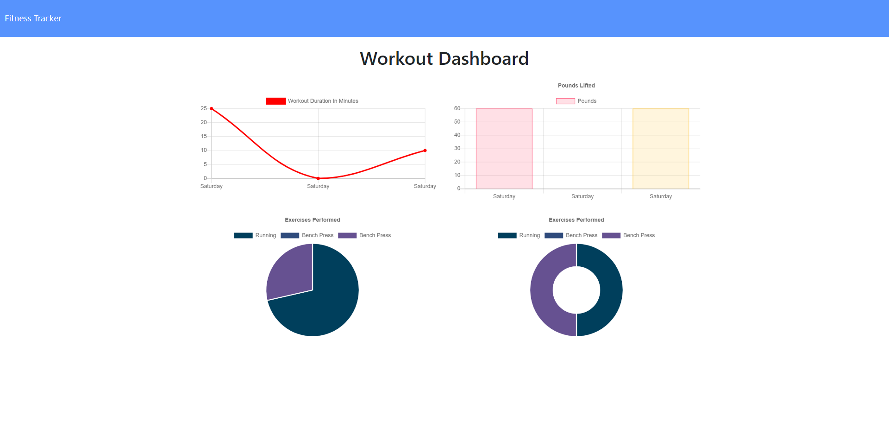

# NoSQL-Workout_Tracker

## Description:
An App that allows users to keep track of their workout progress.

## Repository
[Application Repository URL](https://github.com/cmcunningham27/NoSQL-Workout_Tracker)

## Table of contents
* [Project's-aim](#project's-aim)
* [How-to-use](#how-to-use)
* [Link-to-deployed-application](#link-to-deployed-application)
* [Technologies](#technologies)
* [Contributors](#contributors)
* [Challenges](#Challenges)
* [License](#license)
* [Possible-future-add-ons](#possible-future-add-ons)
* [Questions](#questions)

## Project's aim
To help promote a user reaching their fitness goals more quickly. Users will be able to VIEW, CREATE, and TRACK their daily workouts. They will have the ability to LOG multiple exercises in A workout on a GIVEN DAY. When adding a new exercise, they have the choice to add it to a RECENT or NEW workout plan. Users can VIEW combined WEIGHT from multiple exercises and/or the TOTAL DURATION of each workout from the last 7 workouts.

## How to use

## Link to deployed application:
[Workout Tracker](https://blooming-oasis-14298.herokuapp.com)

## Technologies
Project is created with:

* CSS 
* Javascript
* HTML
* Express.js
* Mongoose
* MongoDB
* Morgan

## Contributors:
* [Cassandra-Cunningham](https://github.com/cmcunningham27)

## Challenges
- I noticed that when a user has not created any workouts yet, the Create Your First Workout div did not appear. I added a querySelector with style.display to equal block and that fixed the error. Don't want to change much more of the given code, so it's not as pretty as I would normally have it. But, the error is corrected.
- There were a few errors I was running into when it came to the code we were given before starting to add our own code to the Homework. Periodically they were fixed. I had to change some code in the seed.js file because the code I was given was not collecting the data correctly. In the stats.js file, on line 204, needed to simplify it away from Set and just have it say return workouts for it to work correctly in the stats.html file.
- I really struggled with figuring out how to use aggregate in order to get the totalDuration in the api get requests. After much searching, a fellow coder had informed me that the aggregate goes in place of the .find(). I did this and it still was not working for me. However, after some time I realized it was because I was missing the "s" at the end of $addFields. Once this was changed everything worked accordingly.
- I left morgan in the package.json as it was given to us to be included. However, I do not understand why it is there when I did not have to use it to accomplish all of the criteria that needed to be met.
- Heroku and MongoDB Atlas proved to be difficult when it came to functionality on the deployed app. Everything worked correctly locally. However, I had to change from using "Atlas Admin" to "Read and Write" in Atlas when creating a database Username and Password. This worked, but I found, after some time, that if you switch it back you need to use a different password or it wouldn't work again. Who knew it would be so touchy when it comes to passwords and switching options. None-the-less I got it figured out!
- A final challenge that I did not try to fix, on the given code side, is that when you go to the homepage of the deployed app and have not created your first workout, the DevTools gets 400 errors due to the fact that there is no data in the database yet. Since, that was not something we were suppose to change at all, and I ran out of time as the homework is due in an hour, I have let it be. It still renders what it is suppose to for the first time user.

## License
This project is licensed under the MIT license.

## Possible future add-ons

## Questions
[E-mail](mailto:sttepstutoring@yahoo.com)

E-mailing me is the best option